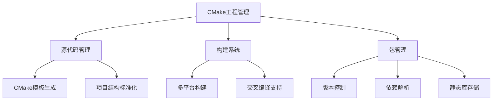

# CMake工程管理技术路线规划

## 当前项目分析
- 这是一个Rust项目，主要代码在src目录
- 目前没有CMake相关文件，需要新增CMake支持

## 技术路线图

## 实施步骤建议

### 阶段1：基础CMake支持
- 设计CMake模板系统
- 实现项目初始化命令
- 支持基本构建流程

### 阶段2：包管理功能
- 实现静态库打包
- 设计版本管理方案
- 开发依赖解析器

### 阶段3：高级功能
- 支持多平台构建
- 集成测试框架
- 实现发布流程

## 待确认问题
- 目标平台要求(Windows/Linux/macOS)
- 是否需要支持交叉编译
- 静态库存储方案偏好(本地/远程)
